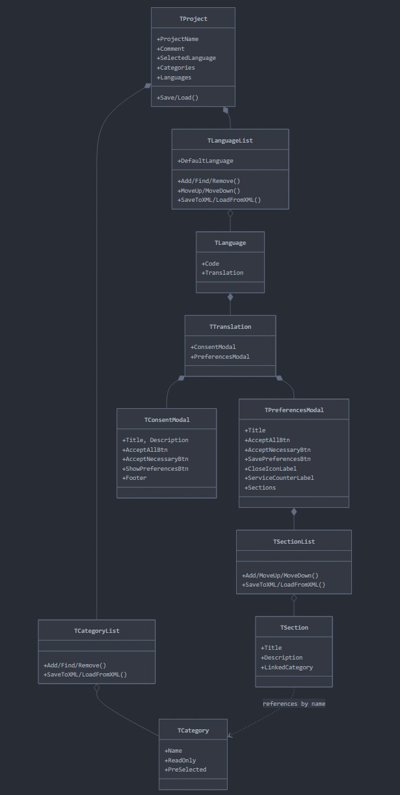

# Data model

## Source

	classDiagram
	    %% Main Project Class
	    class TProject {
	        +ProjectName
	        +Comment
	        +SelectedLanguage
	        +Save/Load()
	        +Categories
	        +Languages
	    }
	
	    %% Category Classes
	    class TCategory {
	        +Name
	        +ReadOnly
	        +PreSelected
	    }
	
	    class TCategoryList {
	        +Add/Find/Remove()
	        +SaveToXML/LoadFromXML()
	    }
	
	    %% Language Classes
	    class TLanguage {
	        +Code
	        +Translation
	    }
	
	    class TLanguageList {
	        +DefaultLanguage
	        +Add/Find/Remove()
	        +MoveUp/MoveDown()
	        +SaveToXML/LoadFromXML()
	    }
	
	    %% Translation Structure
	    class TTranslation {
	        +ConsentModal
	        +PreferencesModal
	    }
	
	    class TConsentModal {
	        +Title, Description
	        +AcceptAllBtn
	        +AcceptNecessaryBtn
	        +ShowPreferencesBtn
	        +Footer
	    }
	
	    class TPreferencesModal {
	        +Title
	        +AcceptAllBtn
	        +AcceptNecessaryBtn
	        +SavePreferencesBtn
	        +CloseIconLabel
	        +ServiceCounterLabel
	        +Sections
	    }
	
	    %% Section Classes
	    class TSection {
	        +Title
	        +Description
	        +LinkedCategory
	    }
	
	    class TSectionList {
	        +Add/MoveUp/MoveDown()
	        +SaveToXML/LoadFromXML()
	    }
	
	    %% Relationships
	    TProject *-- TCategoryList
	    TProject *-- TLanguageList
	    TCategoryList o-- TCategory
	    TLanguageList o-- TLanguage
	    TLanguage *-- TTranslation
	    TTranslation *-- TConsentModal
	    TTranslation *-- TPreferencesModal
	    TPreferencesModal *-- TSectionList
	    TSectionList o-- TSection
	    TSection ..> TCategory : references by name